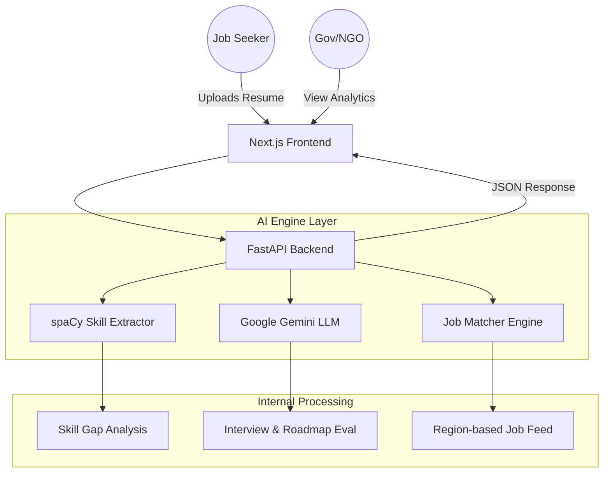

# SkillBridge AI (Career Setu) 🚀
### *Empowering the Future Workforce with AI-Driven Career Intelligence*

[](https://nextjs.org/)
[](https://fastapi.tiangolo.com/)
[](https://ai.google.dev/)
[](https://www.docker.com/)

---

## 🌟 Vision
**SkillBridge AI** is a transformative platform designed to solve the critical "Skill-to-Job" mismatch. By leveraging Industry 4.0 technologies (NLP, LLMs, and Data Analytics), we provide a localized, intelligent ecosystem for job seekers, training providers, and government agencies to synchronize their efforts and maximize national productivity.

---

## 🚀 Key Innovation Highlights

> [!IMPORTANT]
> **What makes us different?**
> Unlike standard job portals, SkillBridge AI uses **spaCy-driven NLP** to parse unstructured regional resumes and **Google Gemini LLM** to generate personalized, empathetic mock interview evaluations and career roadmaps that feel human-centric.

---

## 🛠️ Core AI Components

### 1. 📂 Intelligent Resume Scorer (ATS 2.0)
- **Deep Parsing**: Uses NLP (spaCy) to extract skills, experience levels, and contact data from uploaded documents.
- **ATS Compatibility**: Scores resumes against target roles and identifies specific "Missing Keywords" that standard parsers often miss.
- **Actionable Feedback**: Provides qualitative suggestions on how to improve professional impact.

### 2. 🗺️ Dynamic 30/60/90 Day Roadmaps
- **Knowledge Graph**: Maps user skill gaps to top-tier educational resources automatically.
- **Structured Learning**: Breaks down complex transitions (e.g., Clerk to Data Entry) into digestible monthly milestones.

### 3. 🎙️ AI-Powered Interview Coach
- **Realistic Simulations**: Generates role-based questions tailored to the user's specific career path.
- **Real-time Feedback**: Analyzes answers and provides scoring on technical correctness, confidence, and professionalism.

### 4. 📊 Workforce Analytics for Social Impact
- **Heatmaps**: Identifies regional skill clusters and "demand vs. supply" deficits at the district level.
- **Decision Support**: Enables NGOs and Government bodies to allocate training budgets where they are needed most.

---

## 🏛️ System Architecture



---

## 💻 Tech Stack
- **Frontend**: `Next.js 14`, `Tailwind CSS`, `Framer Motion` (Premium Animations), `Lucide React`.
- **Backend API**: `FastAPI` (Python 3.11), `Uvicorn`, `Pydantic`.
- **AI Ecosystem**: `spaCy` (State-of-the-art NLP), `Google Generative AI` (Gemini), `scikit-learn`.
- **Infrastructure**: `Docker`, `Docker Compose`.

---

## ⚙️ Quick Start Guide

### 📂 Repository Clone
```bash
git clone https://github.com/sachinyaduvanshi553-debug/CAREER-SETU---AI.git
cd CAREER-SETU---AI
```

### 🐳 The One-Command Run (Docker)
> [!TIP]
> This is the fastest way to get everything running in a production-mirror environment.

```bash
docker-compose up --build
```
Access at:
- **Web App**: `http://localhost:3000`
- **Interactive API Docs**: `http://localhost:8000/docs`

### 🐍 Manual Setup (Developer Mode)

#### 1. Backend
```bash
cd backend
pip install -r requirements.txt
python -m spacy download en_core_web_sm
python -m app.main
```

#### 2. Frontend
```bash
cd frontend
npm install
npm run dev
```

---

## 🎯 Hackathon Evaluation Criteria Compliance
- **Innovation**: Real-time LLM-based feedback loop for soft skills and technical proficiency.
- **Impact**: Multi-language support capability and district-level workforce mapping.
- **Technical Excellence**: Modern full-stack architecture with high-concurrency capability (FastAPI/Next.js).
- **Usability**: Premium dark-mode UI with a focus on accessibility and micro-interactions.

---

Developed with 💎 for Excellence.
**Team SkillBridge AI**
