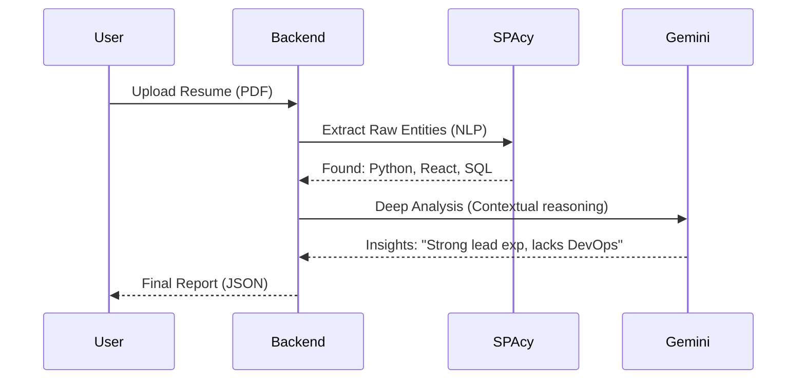

# 🏗️ CAREER BRIDGE - AI: Deep Technical Architecture & API Documentation

This document provides the definitive technical specification for the Career Setu - AI platform, including backend logic, API schemas, and AI integration patterns.

---

## 1. System Topology

Career Setu leverages a **Modern Full-Stack Python/Node Ecosystem**:
- **Frontend**: Next.js 14 (App Router) + Tailwind CSS + GSAP.
- **Backend**: FastAPI (Python 3.11) + Socket.io (Real-time).
- **Database**: MongoDB (Async Motor driver).
- **AI**: Google Gemini 1.5 Flash (Cloud) + spaCy (Local).

---

## 2. Core API Specification

### 2.1. Authentication & Profile
| Method | Endpoint | Description |
| :--- | :--- | :--- |
| `POST` | `/api/auth/register` | User onboarding with role selection (Worker/Professional/Customer). |
| `POST` | `/api/auth/login` | JWT-based authentication. |
| `GET` | `/api/profile` | Fetches consolidated user data including role-specific info. |
| `POST` | `/api/profile/update` | Updates bio, skills, and social links. |

### 2.2. AI Intelligence Engines
| Method | Endpoint | AI Model | Task |
| :--- | :--- | :--- | :--- |
| `POST` | `/api/resume/analyze` | Gemini 1.5 | Full ATS scoring and structural analysis. |
| `POST` | `/api/skills/gap` | spaCy + Logic| Calculates delta between profile & role. |
| `GET` | `/api/roadmap/{id}` | Gemini 1.5 | Generates 90-day learning roadmap. |
| `POST` | `/api/interview/evaluate` | Gemini 1.5 | Semantic evaluation of user answers. |

---

## 3. Data Models (Pydantic)

The backend uses strictly typed models for validation:

```python
class UserProfile(BaseModel):
    name: str
    email: EmailStr
    role: UserRole # Enum: worker, professional, customer, admin
    skills: List[str] = []
    is_verified: bool = False
    location: str

class ResumeAnalysis(BaseModel):
    overall_score: int
    extracted_skills: List[str]
    missing_keywords: List[str]
    suggestions: List[str]
    strengths: List[str]
```

---

## 4. AI Workflow Logic

### 4.1. Hybrid AI Extraction
The system uses a sequential pipeline to optimize for both speed and depth:



---

## 5. Real-Time Communication (Socket.IO)

The platform handles real-time marketplace events:

- **Namespace**: `/ws`
- **Events**:
    - `authenticate`: Link socket ID to User Email.
    - `request_update`: Notify customer when a worker accepts a job.
    - `chat_message`: Direct delivery of messages.
    - `broadcast_worker_update`: Notify all workers of new available tasks.

---

## 6. Directory Structure

```text
CAREER-SETU---AI/
├── frontend/             # Next.js 14 Web Application
│   ├── src/app           # Page Routes
│   ├── src/components    # UI Components (Lucide/GSAP)
│   └── src/lib           # API Client & WebSockets
└── backend/              # FastAPI Application
    ├── app/main.py       # Server Entry Point
    ├── app/routers       # Feature-specific controllers
    ├── app/services      # Cloud Service Logic (Gemini/CDN)
    └── data/             # Mock Datasets (CSV)
```

---

## 7. Environment Variables (.env)

Essential keys for reproduction:
- `MONGO_URL`: MongoDB connection string.
- `GEMINI_API_KEY`: Google AI credentials.
- `JWT_SECRET_KEY`: Security token signing.
- `CLOUDINARY_URL`: Media storage (optional local fallback).

## 8. Development & Deployment Workflow

The platform is designed for scalable growth and ease of onboarding.

### 8.1. Local Setup Workflow
1. **Environment**: Python 3.11 virtual environment.
2. **Dependencies**: `pip install -r requirements.txt`.
3. **Database**: Local MongoDB instance (v6.0+).
4. **NLP Models**: `python -m spacy download en_core_web_sm`.

### 8.2. Continuous Integration / CI
- **Linting**: Standard ESLint for Next.js and Flake8 for FastAPI.
- **Testing**: `pytest` for backend engines; `next lint` for frontend integrity.

### 8.3. Deployment Topology
- **Production URL**: [https://career-setu.onrender.com](https://career-setu.onrender.com)
- **Host**: Render.com (Unified for both layers or Decoupled).
- **SSL**: Automatic via Cloudflare/Render.

---

## 9. Feature Specific Architecture

### 9.1. The Skill Gap Mechanism
1. **Input**: User skills array + Job Role requirements (from `skills_roles_dataset.csv`).
2. **Logic**:
   - Exact string matching.
   - Case-insensitive normalization.
   - Skill "Readiness" calculation using weighted scoring.

### 9.2. Interview Feedback Engine
1. **Voice Input**: Captures audio fragment -> STT (Browser API).
2. **Processing**: Transcript sent to `/api/interview/evaluate`.
3. **AI Evaluation**: Gemini 1.5 Flash compares the transcript against the "Ideal Answer" from `interview_qa_dataset.csv`.
4. **Feedback loop**: Returns `score`, `strengths`, and `improvements`.

---
*Last Updated: 2026-04-17 | CAREER BRIDGE - AI Technical Team*
